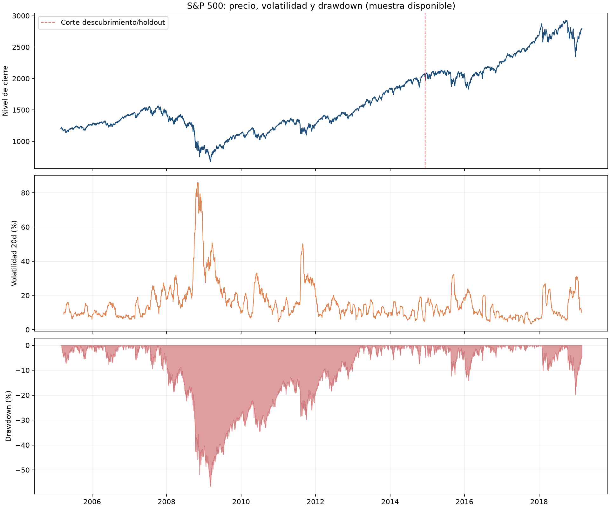
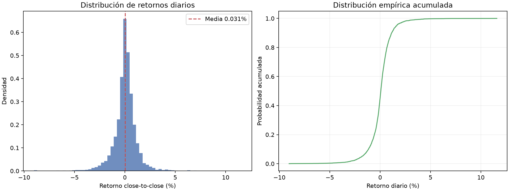
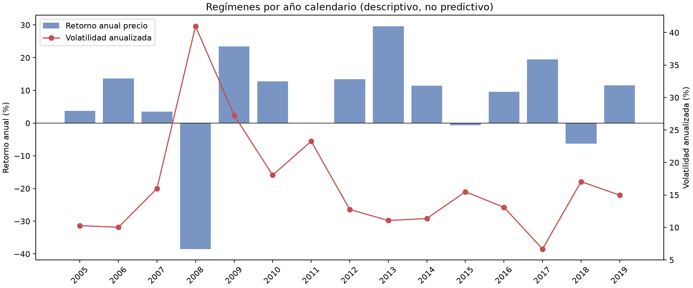
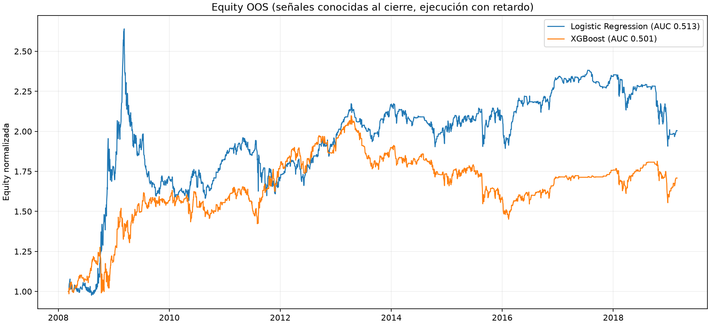
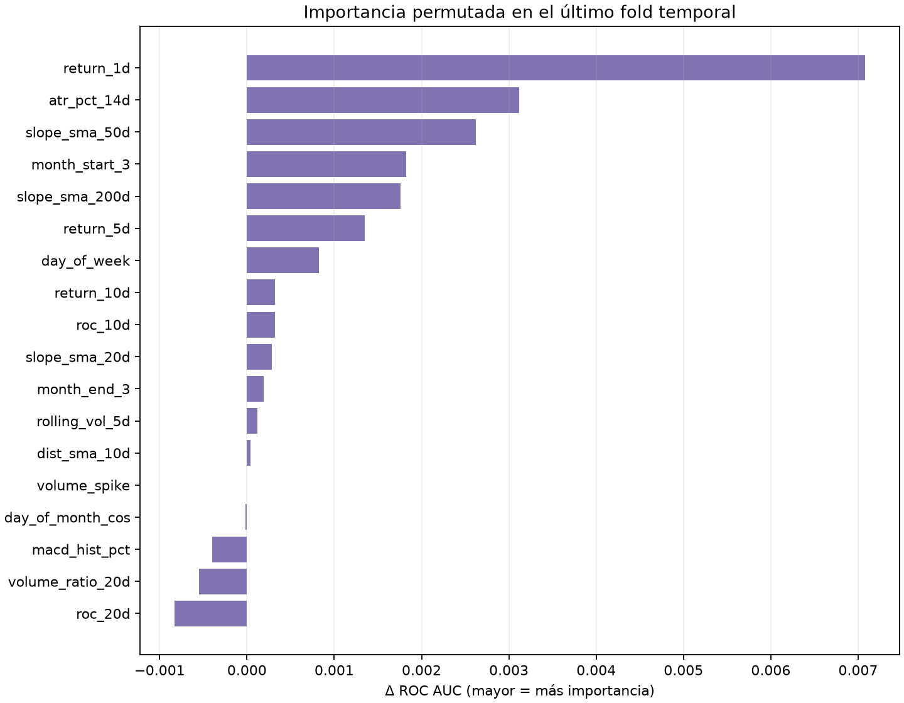

# Informe de Quant Research — S&P 500

**Generado:** 2026-10-07T09:55:55+00:00  
**Fuente:** `/home/user/Data-Analysis/economics/^GSPC.csv`  
**Relación:** `^GSPC.csv`  
**Muestra:** 2005-02-28 a 2019-02-25 · 3.522 observaciones

> **Conclusión ejecutiva.** Este informe busca señales predictivas, no describe el mercado por sí mismo. Solo se consideran hallazgos los patrones que superan los filtros preespecificados de frecuencia, significancia fuera de muestra, consistencia temporal y backtest neto. No inferir causalidad ni usarlo como recomendación financiera.

> **DuckDB:** no se consultó una relación DuckDB en esta ejecución; se utilizó el CSV local disponible. El CLI admite una base DuckDB read-only mediante `--database` y puede listar tablas con `--table` opcional.

## 1. Resumen de resultados

- Reglas/hipótesis de cribado con n≥100 en descubrimiento: **25.188 tests direccionales** (antes de FDR).
- Átomos de condición: **118**; conjunciones generadas: **1.223.054**; máximo 4 condiciones, combinadas entre familias distintas.
- Reglas evaluadas en holdout cronológico: **100**; reglas con ≥100 casos OOS: **42**; reglas que superaron todos los filtros: **0**.
- **No se validó ningún patrón** bajo los filtros establecidos. La recomendación cuantitativa es no desplegar una regla basada en esta muestra; una tabla vacía de hallazgos validados es preferible a rebajar los criterios tras ver los resultados.
- La muestra termina en **2019-02-25**; no constituye información actual. La serie es de precio del índice y puede no incluir dividendos; el volumen agregado del índice no es directamente ejecutable.

## 2. Fuente, tablas y calidad de datos

Relación seleccionada: `^GSPC.csv`. El cierre de análisis usa `Adj Close` cuando está disponible y no nulo; en caso contrario, `Close`.

| Esquema | Tabla/relación | Tipo | Filas | Campos OHLCV |
| --- | --- | --- | --- | --- |
| file | ^GSPC.csv | CSV | 3.522 | 5 |

Filas de entrada: 3522; filas tras limpieza: 3522; fechas duplicadas descartadas: 0; fechas inválidas: 0; cierres inválidos eliminados: 0.

Se calculan nulos por columna, valores únicos y atípicos univariados por regla de 1,5×IQR. Ese umbral es descriptivo y no elimina observaciones: los eventos de cola permanecen en la serie.

No se observaron nulos en las columnas originales usadas por el análisis. Los NaN de calentamiento de indicadores (por ejemplo, SMA200) son esperados y se excluyen de ML hasta que las features están disponibles.

### Estadísticas y distribuciones

`descriptive_stats.csv` incluye media, desviación, cuantiles 1/5/25/50/75/95/99, asimetría, curtosis y conteo IQR para columnas numéricas, retornos y una selección de indicadores.

Retorno diario close-to-close: media 0.03%, desviación 1.18%, q01 -3.47%, mediana 0.07%, q99 3.38%, mínimo -9.03%, máximo 11.58%; atípicos 1,5×IQR = 305.

### Cambios temporales / regímenes

La tabla anual y la figura de volatilidad muestran cambios descriptivos. Tres contrastes de dos mitades se fijan antes de minar reglas, no buscan la fecha de ruptura que maximice el estadístico y sus p se ajustan con Holm; no prueban un régimen permanente.

| Año | Sesiones | Retorno precio | Vol anualizada | Sharpe diario | Días al alza | Máx. DD intra-año |
| --- | --- | --- | --- | --- | --- | --- |
| 2005 | 213 | 3.71% | 10.27% | 0.471 | 55.87% | -7.17% |
| 2006 | 251 | 13.62% | 10.03% | 1.329 | 56.18% | -7.70% |
| 2007 | 251 | 3.53% | 15.99% | 0.298 | 54.58% | -10.09% |
| 2008 | 253 | -38.49% | 40.97% | -0.976 | 49.80% | -48.76% |
| 2009 | 252 | 23.45% | 27.29% | 0.908 | 55.56% | -27.62% |
| 2010 | 252 | 12.78% | 18.05% | 0.757 | 57.14% | -15.99% |
| 2011 | 252 | -0.00% | 23.27% | 0.116 | 54.76% | -19.39% |
| 2012 | 250 | 13.41% | 12.77% | 1.057 | 52.80% | -9.94% |
| 2013 | 252 | 29.60% | 11.07% | 2.399 | 58.33% | -5.76% |
| 2014 | 252 | 11.39% | 11.37% | 1.006 | 57.14% | -7.40% |
| 2015 | 252 | -0.73% | 15.49% | 0.030 | 47.22% | -12.35% |
| 2016 | 252 | 9.54% | 13.09% | 0.761 | 51.98% | -10.51% |
| 2017 | 251 | 19.42% | 6.69% | 2.699 | 56.97% | -2.80% |
| 2018 | 251 | -6.24% | 17.05% | -0.294 | 52.59% | -19.78% |
| 2019 | 37 | 11.54% | 14.97% | 5.048 | 72.97% | -2.48% |

| Contraste | Corte | 1ª mitad | 2ª mitad | p | p Holm |
| --- | --- | --- | --- | --- | --- |
| Welch mean daily return: first vs second half | 2012-02-24 | 0.000178 | 0.000441 | 0.508 | 0.508 |
| Welch absolute daily return: first vs second half | 2012-02-24 | 0.009302 | 0.005767 | <0.001 | <0.001 |
| Levene variance: first vs second half | 2012-02-24 | 0.000213 | 0.000067 | <0.001 | <0.001 |

## 3. Features generadas

Se generaron **54** columnas de features; 44 figuran como entrada candidata para ML. Las SMA absolutas, ATR en puntos y OBV se conservan y documentan, pero el set ML prioriza distancias, pendientes y ratios estacionarios para reducir dependencia del nivel del índice.

Familias: retornos 1/3/5/10/20d; volatilidad anualizada rolling 5/10/20, ratio 20/60 y ATR(14) de Wilder; SMA 5/10/20/50/200, distancia y pendiente; RSI14, ROC10/20, MACD/Signal/Histograma y z-score20; día de semana/mes/semana ISO, mes, codificación cíclica y flags de cierres festivos; volumen relativo/spike y OBV/pendiente. `feature_catalog.csv` contiene la definición operativa y faltantes por indicador. Al recibirse una única serie (^GSPC), no se calcula fuerza relativa cross-sectional entre activos; se analizan momentum y tendencia de esa misma serie.

**Festivos:** cuando se dispone de calendario NYSE se usan sesiones programadas; el informe marca pre/post-cierre. En su defecto el código cae a gaps observados, que pueden confundirse con días de datos ausentes y quedan documentados en la implementación.

## 4. Discovery Engine y validación de patrones

Corte cronológico: descubrimiento hasta **2014-12-10**; holdout desde **2014-12-11**. Los cuantiles de umbral se estiman solo en descubrimiento. Se probaron horizontes de 1, 3 y 5 sesiones; etiquetas de precio forward close-to-close.

En descubrimiento hubo 1.867 tests con p nominal≤0,05 y 13 con q Benjamini–Hochberg≤0,05, de 25.188 tests elegibles. El cribado usa una aproximación binomial solo para ordenar y reducir candidatos; no se interpreta como inferencia final.

El holdout está reservado a las candidatas elegidas usando únicamente descubrimiento. En el holdout se contrasta la mejora de acierto frente a los días sin señal con errores estándar HAC/Newey–West (rezago máximo al menos 5, ampliado al horizonte), y se vuelve a controlar FDR sobre las candidatas. Los retornos forward de 3/5d se solapan; el ajuste HAC no elimina todos los sesgos posibles.

Filtros de publicación: ≥100 observaciones tanto en descubrimiento como en holdout; p y q OOS ≤0,05; win rate direccional OOS ≥55%; retorno direccional medio positivo; Sharpe neto positivo; habilidad positiva en ≥3 de 4 subperiodos con ≥20 señales cada uno; como máximo 3 condiciones para publicar. El ranking ordena primero la consistencia, después penaliza complejidad.

### Ranking final de patrones validados

**Ninguna regla superó simultáneamente los filtros. No se relajan los umbrales.** Las reglas cribadas pero rechazadas permanecen en `pattern_candidates.csv` para auditoría.

### Candidatas top de descubrimiento (NO validadas por defecto)

Esta tabla es un registro de búsqueda, no una recomendación. La selección de estas filas se hizo en el train; cada estado rechazado nombra los filtros incumplidos.

| Selección | Condición | H | Dirección | n train | n OOS | WR OOS | HAC p | q OOS | Sharpe |
| --- | --- | --- | --- | --- | --- | --- | --- | --- | --- |
| 1 | slope_sma_50d ≤ Q25 (-0.00034302) AND macd_hist_pct ≥ Q90 (0.0037858) | 3 | DOWN | 129 | 60 | — | — | — | — |
| 2 | return_5d ≥ Q75 (0.014528) AND slope_sma_50d ≤ Q25 (-0.00034302) | 3 | DOWN | 167 | 66 | — | — | — | — |
| 3 | atr_pct_14d ≤ Q25 (0.0084137) AND dist_sma_200d ≥ Q75 (0.079821) AND zscore_close_20d ≥ Q75 (1.3434) | 5 | DOWN | 100 | 35 | — | — | — | — |
| 4 | Nuevo máximo de cierre 20d AND rolling_vol_20d ≤ Q25 (0.094274) | 5 | DOWN | 171 | 102 | 42.16% | 0.305 | 0.715 | -0.896 |
| 5 | Nuevo máximo de cierre 20d AND rolling_vol_20d ≤ Q25 (0.094274) AND zscore_close_20d ≥ Q75 (1.3434) | 5 | DOWN | 156 | 89 | — | — | — | — |
| 6 | return_5d ≥ Q75 (0.014528) AND rolling_vol_20d ≥ Q75 (0.19142) AND slope_sma_50d ≤ Q25 (-0.00034302) | 3 | DOWN | 126 | 45 | — | — | — | — |
| 7 | return_5d ≥ Q75 (0.014528) AND atr_pct_14d ≥ Q75 (0.015552) AND slope_sma_50d ≤ Q25 (-0.00034302) | 3 | DOWN | 121 | 50 | — | — | — | — |
| 8 | return_5d ≥ Q75 (0.014528) AND slope_sma_50d ≤ Q25 (-0.00034302) | 5 | DOWN | 167 | 66 | — | — | — | — |
| 9 | Nuevo máximo de cierre 50d AND rolling_vol_20d ≤ Q25 (0.094274) | 5 | DOWN | 167 | 96 | — | — | — | — |
| 10 | Nuevo máximo de cierre 50d AND rolling_vol_20d ≤ Q25 (0.094274) AND zscore_close_20d ≥ Q75 (1.3434) | 5 | DOWN | 152 | 84 | — | — | — | — |
| 11 | rolling_vol_20d ≥ Q75 (0.19142) AND slope_sma_50d ≤ Q25 (-0.00034302) AND macd_hist_pct ≥ Q90 (0.0037858) | 3 | DOWN | 115 | 36 | — | — | — | — |
| 12 | atr_pct_14d ≥ Q75 (0.015552) AND slope_sma_50d ≤ Q25 (-0.00034302) AND macd_hist_pct ≥ Q90 (0.0037858) | 3 | DOWN | 115 | 42 | — | — | — | — |

Métricas de subperiodo para candidatas: `pattern_periods.csv` (incluye los periodos donde la señal no tuvo skill o frecuencia suficiente).

## 5. Machine learning exploratorio

Validación: `TimeSeriesSplit` expansivo, 5 pliegues, `gap` igual al horizonte (purga del solapamiento del target). Imputación/escalado se ajustan dentro del pliegue. No hay particiones aleatorias ni tuning de hiperparámetros sobre el test.

Modelos de clasificación: Logistic Regression, Random Forest, Gradient Boosting, XGBoost, LightGBM y CatBoost. En regresión se usan Ridge Regression, Random Forest, Gradient Boosting, XGBoost, LightGBM y CatBoost (la regresión logística no aplica). Los modelos que no se pudieron importar aparecen como `skipped` en `model_metrics.csv`/`model_availability.csv`.

### Clasificación direction(t+1)

| Modelo | n OOS | Accuracy | Baseline mayoritaria | Precision | Recall | F1 | ROC AUC | Sharpe neto | CAGR | MDD |
| --- | --- | --- | --- | --- | --- | --- | --- | --- | --- | --- |
| Logistic Regression | 2.760 | 52.10% | 54.42% | 54.68% | 70.04% | 0.614 | 0.513 | 0.458 | 6.55% | -40.60% |
| XGBoost | 2.760 | 52.86% | 54.42% | 54.83% | 75.97% | 0.637 | 0.501 | 0.390 | 5.01% | -30.84% |
| LightGBM | 2.760 | 52.93% | 54.42% | 55.19% | 71.84% | 0.624 | 0.498 | 0.256 | 2.92% | -43.80% |
| Random Forest | 2.760 | 52.17% | 54.42% | 54.44% | 74.30% | 0.628 | 0.497 | 0.367 | 4.61% | -24.54% |
| CatBoost | 2.760 | 53.44% | 54.42% | 55.02% | 79.23% | 0.649 | 0.497 | 0.253 | 2.80% | -29.95% |
| Gradient Boosting | 2.760 | 51.49% | 54.42% | 54.02% | 72.84% | 0.620 | 0.491 | 0.301 | 3.62% | -31.10% |

### Clasificación direction(t+5)

| Modelo | n OOS | Accuracy | Baseline mayoritaria | Precision | Recall | F1 | ROC AUC | Sharpe neto | CAGR | MDD |
| --- | --- | --- | --- | --- | --- | --- | --- | --- | --- | --- |
| Logistic Regression | 2.760 | 55.47% | 58.91% | 60.44% | 70.66% | 0.652 | 0.528 | 0.282 | 3.11% | -40.86% |
| XGBoost | 2.760 | 54.96% | 58.91% | 59.37% | 74.60% | 0.661 | 0.502 | 0.107 | 0.53% | -32.45% |
| LightGBM | 2.760 | 53.19% | 58.91% | 58.86% | 68.20% | 0.632 | 0.501 | -0.154 | -3.19% | -54.24% |
| Random Forest | 2.760 | 52.46% | 58.91% | 58.04% | 69.68% | 0.633 | 0.487 | -0.024 | -1.00% | -28.94% |
| Gradient Boosting | 2.760 | 52.07% | 58.91% | 57.76% | 69.37% | 0.630 | 0.482 | -0.063 | -1.99% | -39.81% |
| CatBoost | 2.760 | 52.57% | 58.91% | 57.60% | 73.86% | 0.647 | 0.474 | -0.056 | -1.93% | -41.04% |

### Regresión return(t+1)

| Modelo | n OOS | MAE | RMSE | R² | Spearman IC | Accuracy signo | Baseline mayoritaria | ROC AUC signo | Sharpe neto | MDD |
| --- | --- | --- | --- | --- | --- | --- | --- | --- | --- | --- |
| Ridge Regression | 2.760 | 0.009 | 0.014 | -0.260 | 0.015 | 51.05% | 54.42% | 0.508 | 0.181 | -50.95% |
| LightGBM | 2.760 | 0.008 | 0.013 | -0.018 | 0.024 | 50.76% | 54.42% | 0.501 | 0.113 | -59.61% |
| CatBoost | 2.760 | 0.008 | 0.013 | 0.000 | 0.013 | 51.63% | 54.42% | 0.496 | 0.331 | -42.75% |
| Gradient Boosting | 2.760 | 0.008 | 0.013 | -0.002 | 0.015 | 52.68% | 54.42% | 0.493 | 0.563 | -35.85% |
| XGBoost | 2.760 | 0.008 | 0.013 | -0.006 | 0.010 | 51.38% | 54.42% | 0.492 | 0.313 | -48.63% |
| Random Forest | 2.760 | 0.008 | 0.013 | 0.004 | 0.005 | 50.54% | 54.42% | 0.492 | 0.277 | -52.96% |

### Regresión return(t+5)

| Modelo | n OOS | MAE | RMSE | R² | Spearman IC | Accuracy signo | Baseline mayoritaria | ROC AUC signo | Sharpe neto | MDD |
| --- | --- | --- | --- | --- | --- | --- | --- | --- | --- | --- |
| Ridge Regression | 2.760 | 0.021 | 0.032 | -0.677 | 0.009 | 51.23% | 58.91% | 0.510 | 0.048 | -43.01% |
| Random Forest | 2.760 | 0.017 | 0.025 | -0.013 | 0.013 | 54.93% | 58.91% | 0.496 | 0.169 | -37.37% |
| CatBoost | 2.760 | 0.017 | 0.025 | -0.030 | -0.014 | 54.02% | 58.91% | 0.491 | 0.034 | -46.41% |
| LightGBM | 2.760 | 0.017 | 0.026 | -0.061 | -0.021 | 51.09% | 58.91% | 0.482 | -0.305 | -57.16% |
| Gradient Boosting | 2.760 | 0.017 | 0.026 | -0.049 | -0.029 | 52.50% | 58.91% | 0.480 | -0.182 | -57.85% |
| XGBoost | 2.760 | 0.017 | 0.026 | -0.045 | -0.038 | 51.67% | 58.91% | 0.474 | -0.243 | -60.44% |

`baseline_accuracy` es el clasificador mayoritario sin features; se reporta para evitar confundir una tasa de acierto alta por tendencia base con capacidad predictiva. `model_fold_metrics.csv` contiene el desglose temporal por fold; `model_predictions.csv` contiene predicciones OOF. En regresión, ROC AUC y accuracy se aplican al signo pronosticado. El backtest usa umbral p(up)≥0,55 / ≤0,45 para clasificación y signo de retorno para regresión.

## 6. Backtests y costes

Se usa coste de **5.0 pb por cambio de una unidad de posición**, long/short/caja, cash=0%, señal conocida al cierre y entrada en la siguiente apertura. Cada señal se mantiene por el horizonte pronosticado (1/3/5 sesiones); las vintages solapadas se promedian para limitar la exposición bruta a 1. El P&L es apertura-a-apertura; si no hay Open, se usa Close-to-Close con retardo. La ejecución sobre el propio índice S&P 500 es un proxy; no modela ETF/futuros, dividendos, borrow fees, impacto, spread ni límites de capacidad.

| Estrategia | Barras | Retorno total | CAGR | Sharpe | MDD | Exposición | Entradas |
| --- | --- | --- | --- | --- | --- | --- | --- |
| Logistic Regression_classification_1d | 2.761 | 100.42% | 6.55% | 0.458 | -40.60% | 63.20% | 439 |
| Random Forest_classification_1d | 2.761 | 63.86% | 4.61% | 0.367 | -24.54% | 62.08% | 426 |
| Gradient Boosting_classification_1d | 2.761 | 47.61% | 3.62% | 0.301 | -31.10% | 65.70% | 410 |
| XGBoost_classification_1d | 2.761 | 70.82% | 5.01% | 0.390 | -30.84% | 59.25% | 450 |
| LightGBM_classification_1d | 2.761 | 37.12% | 2.92% | 0.256 | -43.80% | 67.37% | 434 |
| CatBoost_classification_1d | 2.761 | 35.30% | 2.80% | 0.253 | -29.95% | 57.81% | 421 |
| Ridge Regression_regression_1d | 2.761 | 19.77% | 1.66% | 0.181 | -50.95% | 99.89% | 1 |
| Random Forest_regression_1d | 2.761 | 45.97% | 3.51% | 0.277 | -52.96% | 99.89% | 1 |
| Gradient Boosting_regression_1d | 2.761 | 163.75% | 9.26% | 0.563 | -35.85% | 99.89% | 1 |
| XGBoost_regression_1d | 2.761 | 57.42% | 4.23% | 0.313 | -48.63% | 99.89% | 1 |
| LightGBM_regression_1d | 2.761 | 3.81% | 0.34% | 0.113 | -59.61% | 99.89% | 1 |
| CatBoost_regression_1d | 2.761 | 63.15% | 4.57% | 0.331 | -42.75% | 99.89% | 1 |
| buy_and_hold_1d_window | 2.761 | 110.51% | 7.03% | 0.454 | -52.34% | 100.00% | 1 |
| Logistic Regression_classification_5d | 2.765 | 39.93% | 3.11% | 0.282 | -40.86% | 66.54% | 133 |
| Random Forest_classification_5d | 2.765 | -10.49% | -1.00% | -0.024 | -28.94% | 58.55% | 142 |
| Gradient Boosting_classification_5d | 2.765 | -19.78% | -1.99% | -0.063 | -39.81% | 61.57% | 133 |
| XGBoost_classification_5d | 2.765 | 6.01% | 0.53% | 0.107 | -32.45% | 61.28% | 128 |
| LightGBM_classification_5d | 2.765 | -29.95% | -3.19% | -0.154 | -54.24% | 60.46% | 147 |
| CatBoost_classification_5d | 2.765 | -19.21% | -1.93% | -0.056 | -41.04% | 60.23% | 129 |
| Ridge Regression_regression_5d | 2.765 | -5.34% | -0.50% | 0.048 | -43.01% | 78.28% | 1 |
| Random Forest_regression_5d | 2.765 | 17.00% | 1.44% | 0.169 | -37.37% | 84.38% | 1 |
| Gradient Boosting_regression_5d | 2.765 | -37.78% | -4.23% | -0.182 | -57.85% | 82.92% | 1 |
| XGBoost_regression_5d | 2.765 | -44.02% | -5.15% | -0.243 | -60.44% | 83.47% | 1 |
| LightGBM_regression_5d | 2.765 | -48.18% | -5.82% | -0.305 | -57.16% | 75.41% | 1 |
| CatBoost_regression_5d | 2.765 | -8.95% | -0.85% | 0.034 | -46.41% | 86.77% | 2 |

## 7. Information Gain, Mutual Information e importancia

La información mutua (bits) de cada conjunción frente a la etiqueta alcista se calcula con su tabla de contingencia en train; para una partición binaria, coincide con la ganancia de información. Solo se exporta para la shortlist holdout para mantener el tamaño manejable; el cribado completo contabiliza la familia de hipótesis y su FDR.

Importancia por permutación OOS (último fold cronológico; variación de ROC AUC):
| Feature | Δ AUC medio | Desv. entre permutaciones |
| --- | --- | --- |
| return_1d | 0.007 | 0.009 |
| atr_pct_14d | 0.003 | 0.009 |
| slope_sma_50d | 0.003 | 0.016 |
| month_start_3 | 0.002 | 0.003 |
| slope_sma_200d | 0.002 | 0.003 |
| return_5d | 0.001 | 0.006 |
| day_of_week | 0.001 | 0.002 |
| roc_10d | 0.000 | 0.006 |
| return_10d | 0.000 | 0.006 |
| slope_sma_20d | 0.000 | 0.001 |
| month_end_3 | 0.000 | 0.010 |
| rolling_vol_5d | 0.000 | 0.003 |

SHAP (media de valor absoluto en la muestra explicada; unidad del output del modelo):
| Feature | mean |SHAP| |
| --- | --- |
| rsi_14 | 0.162 |
| day_of_month_sin | 0.135 |
| day_of_month | 0.133 |
| zscore_close_20d | 0.103 |
| month_cos | 0.089 |
| month_end_3 | 0.065 |
| dist_sma_20d | 0.046 |
| dow_cos | 0.044 |
| dow_sin | 0.043 |
| return_1d | 0.039 |
| obv_slope_20d | 0.037 |
| slope_sma_10d | 0.031 |

Estado de explicación: `{"model": "Logistic Regression", "task": "classification_direction_1d", "fold": 5, "test_start": "2016-12-12", "test_end": "2019-02-22", "status": "permutation importance run on final chronological test fold", "shap_status": "completed on up to 150 validation rows"}`.

## 8. Figuras

### Precio, volatilidad realizada y drawdown

### Distribución y CDF empírica de retornos diarios

### Retorno y volatilidad por año

### Equity OOS de modelos/reglas seleccionadas

### Importancia de variables en el último fold OOS

## 9. Recomendación y limitaciones

**No desplegar ninguna señal** de este experimento. La muestra ofrece precios históricos hasta 2019-02 y la búsqueda amplia no encontró una regla que sobreviva a todas las pruebas requeridas. Accuracy o Sharpe atractivos de un modelo individual no bastan si faltan estabilidad, datos recientes, estrategia ejecutable y validación externa independiente.

Limitaciones principales: muestra única y antigua; retornos de precio; posible volumen proxy; p-valores aproximados en el cribado; dependencia serial y solapamiento; un único holdout para reglas; variables técnicas muy correlacionadas; resultados ML con hiperparámetros fijos, no optimizados; backtest de baja fidelidad. Los valores p no implican causalidad.

## 10. Archivos reproducibles

- SQL de extracción/perfil: `sql_used.sql` y plantilla `../sql/exploration.sql`.
- Configuración, corte y procedencia: `analysis_metadata.json` y `discovery_summary.json`.
- Features/condiciones: `feature_catalog.csv`, `condition_catalog.csv`; `features.csv` solo si se solicitó `--export-features`.
- Patrones: `pattern_ranking.csv`, `pattern_candidates.csv`, `pattern_periods.csv`.
- ML/backtest: `model_metrics.csv`, `model_fold_metrics.csv`, `model_predictions.csv`, `backtests.csv`, `feature_importance.csv`, `shap_status.csv`.
- Todos los retornos, condiciones y reglas usan sesiones ordenadas; no se usa validación aleatoria.

---
_Informe de investigación cuantitativa; no constituye asesoramiento financiero._
